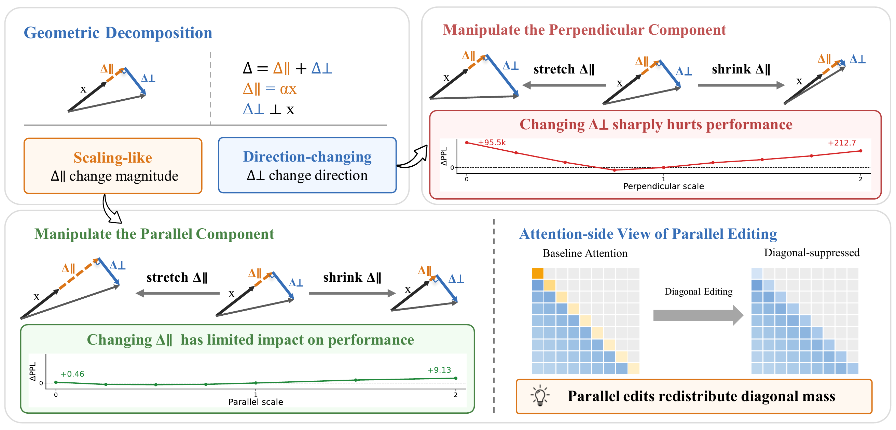

<div align="center">

# 📐 Transformer Geometry
### Decomposing Transformer Updates into Parallel & Perpendicular Subspaces

<p align="center">
  <a href="https://2026.emnlp.org/"></a>
  <a href="https://shwai-he.github.io/Transformer-Geometry/"></a>
  <a href="https://pytorch.org/"></a>
  <a href="https://www.python.org/downloads/"></a>
  <a href="https://huggingface.co/"></a>
</p>

<p align="center">
  <a href="#-overview--core-concept"><b>Overview</b></a> •
  <a href="#-mathematical-foundation"><b>Formulation</b></a> •
  <a href="#-core-research-pillars"><b>Research Pillars</b></a> •
  <a href="#-repository-architecture"><b>Architecture</b></a> •
  <a href="#-installation--setup"><b>Installation</b></a> •
  <a href="#-experiment-execution-guide"><b>Quick Start</b></a>
</p>

---

</div>

## 🌟 Overview & Core Concept

**Transformer Geometry** investigates internal representation dynamics across deep Transformer language models through an orthogonal geometric lens. 

Every hidden-state update $\Delta h$ (produced by multi-head self-attention or feed-forward networks) is decomposed into two complementary geometric components:
1. **Parallel Component ($\Delta h_{\parallel}$)**: Projects directly onto the incoming representation vector $h$. It primarily modulates the **magnitude and scaling** of existing semantic features without altering their direction.
2. **Perpendicular Component ($\Delta h_{\perp}$)**: Lies strictly orthogonal to $h$. It drives **directional rotation and semantic shifts**, steering the representation into new subspaces.

We extend and evaluate this geometric framework across both **Residual-Space** and **Value-Space (XSA)**, uncovering key mechanisms behind inference-time editing, model compression (pruning & quantization), long-context processing, and pretraining optimization dynamics.

<p align="center">
  
</p>

<p align="center">
  <em><b>Figure 1: Geometric Decomposition and Component Scaling.</b> Residual updates and attention value aggregates are decomposed into parallel ($\Delta_\parallel$) and perpendicular ($\Delta_\perp$) components and scaled independently; parallel-only scaling can be expressed as an attention-diagonal change. Changing $\Delta_\parallel$ has limited impact on performance, whereas modifying $\Delta_\perp$ sharply degrades perplexity.</em>
</p>

---

## 🧮 Mathematical Foundation

For a token representation $h_{l-1} \in \mathbb{R}^d$ entering layer $l$ and generating an update $\Delta h_l$:

$$\Delta h_l = \Delta h_{l, \parallel} + \Delta h_{l, \perp}$$

where the parallel component projects directly along the incoming representation:

$$\Delta h_{l, \parallel} = \frac{\langle \Delta h_l, h_{l-1} \rangle}{\|h_{l-1}\|^2} h_{l-1}, \quad \Delta h_{l, \perp} = \Delta h_l - \Delta h_{l, \parallel}$$

Component-scaling interventions systematically modulate the representation trajectory via scaling factors $\alpha$ and $\beta$:

$$h_l = h_{l-1} + \alpha \cdot \Delta h_{l, \parallel} + \beta \cdot \Delta h_{l, \perp}$$

> [!NOTE]
> * **Residual-Space Decomposition**: Operates at the block-output residual stream level ($h_{l} = h_{l-1} + \Delta h_l$).
> * **Value-Space Decomposition (XSA)**: Operates inside the multi-head attention mechanism, projecting aggregated value representations against self-value tokens.

---

## 🔬 Core Research Pillars & Findings

| Pillar | Focus Area | Core Insight / Key Result | Key Script Entrypoint |
| :--- | :--- | :--- | :--- |
| **1. Geometry Probing** | Depth & Subspace Dynamics | Transformer updates maintain a distinct, persistent balance between rescaling-aligned and direction-changing vectors across model families (Qwen, LLaMA, nanoGPT). | `scripts/run_probe.py`<br>`scripts/run_batch_probe.py` |
| **2. Inference Interventions** | Component & Diagonal Editing | Value-parallel scaling ($\Delta h_{\parallel}$) exhibits remarkable resilience, while perturbing the perpendicular component ($\Delta h_{\perp}$) rapidly degrades model perplexity and coherence. | `lm_eval/models/attn_diag_hooks.py`<br>`analysis/forward_geometry/` |
| **3. Downstream & RULER** | Broad Benchmarks & Long Context | Geometric interventions preserve core reasoning while exposing critical sensitivities in long-context needle-retrieval (RULER benchmark suite). | `lm-evaluation-harness/scripts/run_lm_eval_xsa_setting.sh`<br>`.../run_lm_eval_ruler_all_settings.sh` |
| **4. Compression Geometry** | Pruning & Quantization Analysis | Magnitude/Wanda pruning errors heavily distort the perpendicular ($\Delta h_{\perp}$) subspace, while quantization retains update geometry significantly closer to dense baselines. | `compression/code/layerwise_para_perp_compare.py`<br>`compression/code/geometry_aware_pruning.py` |
| **5. Training Optimization** | Scratch Pretraining with Geometric Penalties | Suppressing parallel updates during pretraining alters loss trajectory convergence, demonstrating that geometry directly governs learning dynamics. | `training/`<br>`lm-evaluation-harness/scripts/run_lm_eval_nanogpt_setting.sh` |

---

## 📂 Repository Architecture

```text
Transformer-Geometry/
├── src/repgeo/                 # Reusable core geometry, projection, and intervention utilities
│   ├── geometry_utils.py       # Parallel / perpendicular projection math & metrics
│   └── hooks.py                # PyTorch forward hook mechanisms for dynamic interventions
│
├── lm-evaluation-harness/      # Forked evaluation harness supporting geometric hook configurations
│   ├── lm_eval/models/         # Attention diagonal and residual modification hooks
│   └── scripts/                # Launchers for downstream benchmarks & RULER long-context evals
│
├── analysis/                   # Diagnostic, visualization, and ablation workspaces
│   ├── forward_geometry/       # Alpha/gamma parameter sweeps and forward generation ablations
│   ├── gsm_math/               # Mathematical reasoning & GSM8K dual-path sanity checks
│   ├── model_compare/          # Dense vs. dropped/pruned/masked-teacher subspace comparisons
│   ├── nanogpt/                # Lightweight nanoGPT checkpoint diagnostics and layer visualizations
│   └── vlm_geometry/           # Vision-language model parallel/perpendicular scaling hooks
│
├── compression/                # Pruning and quantization geometric error analysis
│   ├── code/                   # Geometry-aware pruning & layerwise comparison implementations
│   └── scripts/                # Shell runners for intra/inter-layer compression sweeps
│
├── training/                   # Scratch pretraining and optimization dynamics experiments
│   └── scripts/                # Launchers for parallel-suppressed training runs
│
├── scripts/                    # Root-level probing runners and reproducibility utilities
└── requirements.txt            # Base Python dependencies
```

---

## 🛠️ Installation & Setup

### 1. Environment Creation

```bash
# Create dedicated conda environment
conda create -n transformer-geometry python=3.10 -y
conda activate transformer-geometry

# Install root dependencies
pip install -r requirements.txt

# Install the geometric-aware lm-evaluation-harness
cd lm-evaluation-harness
pip install -e .
cd ..
```

### 2. Backends & Acceleration

Ensure you have a CUDA-compatible PyTorch build alongside standard HuggingFace acceleration packages:
```bash
pip install torch torchvision --index-url https://download.pytorch.org/whl/cu121
pip install transformers accelerate datasets evaluate
```

---

## 🚀 Experiment Execution Guide

> [!TIP]
> **File-First Configuration Convention**: Most experiment launchers are configured directly near the top of the shell/Python script. Open the target script to adjust `MODEL_PATH`, `GPU_DEVICES`, and `OUTPUT_DIR` before running.

### 1. Geometry Probing Across Depths
Extract parallel/perpendicular ratios, angular velocities, and magnitude projections:
```bash
# Single model probe
python scripts/run_probe.py --model_path Qwen/Qwen2.5-7B --dataset wikitext

# Batch probing across model families
python scripts/run_batch_probe.py --config configs/probe_models.yaml
```

### 2. Inference-Time Component & Diagonal Interventions
Evaluate the effect of scaling $\Delta h_{\parallel}$ vs $\Delta h_{\perp}$ on language modeling:
```bash
# Run XSA (cross-subspace attention) intervention sweep
bash lm-evaluation-harness/scripts/run_lm_eval_xsa_setting.sh

# Run attention diagonal scaling ablation
bash lm-evaluation-harness/scripts/run_lm_eval_attn_diag_setting.sh
```

### 3. Long-Context RULER Evaluation Suite
Benchmark context-window integrity under geometric modifications:
```bash
bash lm-evaluation-harness/scripts/run_lm_eval_ruler_all_settings.sh
```

### 4. Compression Error & Geometry-Aware Pruning
Analyze distortion caused by pruning (Wanda, SparseGPT) and quantization:
```bash
# Layerwise parallel/perpendicular distortion comparison
bash compression/scripts/run_layerwise_para_perp_compare.sh

# Run geometry-guided pruning
bash compression/scripts/run_geometry_aware_pruning.sh
```

### 5. Training-Time Interventions (nanoGPT & Scratch Sweeps)
Train small-to-medium models with suppressed parallel components and evaluate checkpoints:
```bash
# Pretraining experiments
cd training && bash scripts/run_nanogpt_geom_train.sh && cd ..

# Evaluate trained checkpoints on standard tasks
bash lm-evaluation-harness/scripts/run_lm_eval_nanogpt_setting.sh
python lm-evaluation-harness/scripts/collect_nanogpt_lm_eval_results.py
```

---

## 📖 Module Documentation Index

For detailed workspace-specific guidance, refer to sub-package documentation:
* [lm-evaluation-harness/scripts/README.md](lm-evaluation-harness/scripts/README.md) — Evaluation harness launcher parameters & task definitions.
* [analysis/README.md](analysis/README.md) — Standalone analysis utilities, forward geometry, and visualization tools.
* [compression/README.md](compression/README.md) — Pruning/quantization theory and geometry-aware pruning docs.
* [training/README.md](training/README.md) — Scratch training setups, configs, and checkpoint logging.

---

## 📜 Citation

```bibtex
@inproceedings{he2026transformer_geometry,
  title={Disentangling Representation Evolution in Transformers through Directional Decomposition},
  author={He, Shwai and Zhang, Haichao and Yan, Shen},
  booktitle={Proceedings of the 2026 Conference on Empirical Methods in Natural Language Processing (EMNLP)},
  year={2026}
}
```

<div align="center">
  <sub>Built for principled geometric analysis of deep transformer architectures.</sub>
</div>
