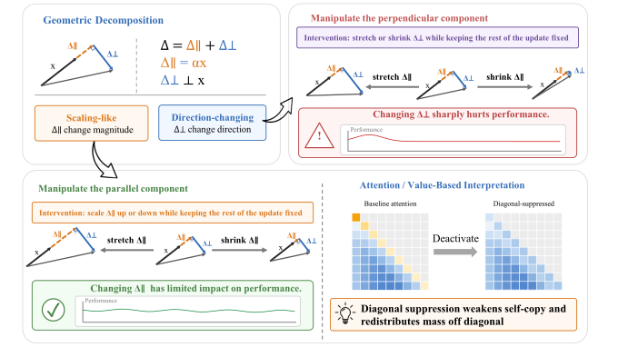
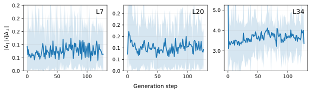
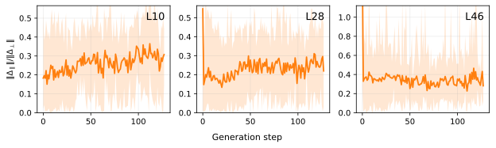
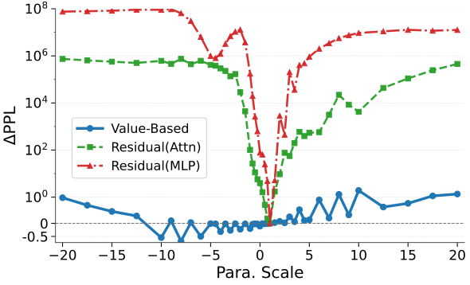
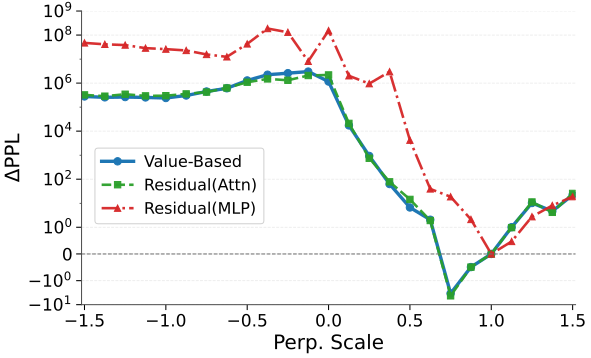
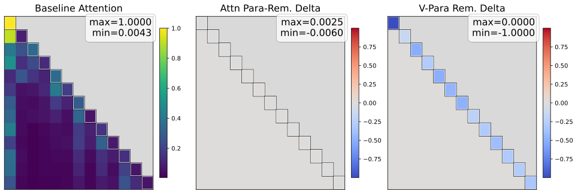
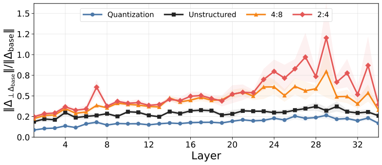
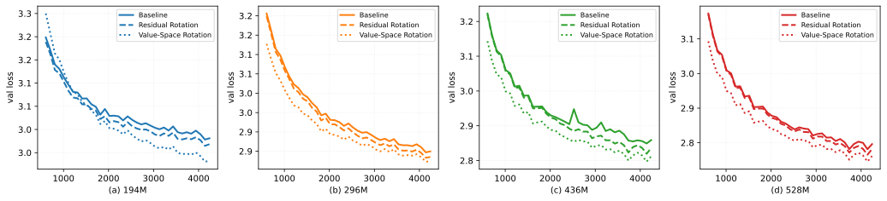

# Transformer Geometry

This repository contains the public codebase for our work on the geometry of transformer computation. The central idea is to decompose a module update into a **parallel** component that mainly rescales the current representation and a **perpendicular** component that changes direction. We use this view to study three connected problems:

- **inference-time component editing**
- **compression diagnostics**
- **training-time intervention**

The public repository is organized around the experiments and analysis code. Paper source files, private drafting assets, and Overleaf-specific materials are not included here.

<p align="center">
  
</p>

## What this repository reproduces

This codebase supports the main experimental threads of the paper:

1. **Geometry probing of pretrained transformers**
   Measure parallel and perpendicular update structure across layers, branches, prompts, and generation steps.
2. **Inference-time editing without additional training**
   Compare residual-space and value-space interventions, including attention-parallel removal and diagonal edits, on general-task benchmarks and long-context RULER evaluation.
3. **Training-time suppression of parallel updates**
   Study how parallel suppression affects optimization and downstream behavior in scratch pretraining runs.
4. **Compression-induced error geometry**
   Analyze pruning and quantization through the same parallel/perpendicular decomposition.
5. **Figure generation and diagnostic visualization**
   Rebuild analysis plots, schematic figures, and inspection notebooks used to interpret the experiments.

## Selected figures and code

The figures below are exported from the paper experiments as SVG assets for quick browsing. Each block points to the code that regenerates or analyzes the corresponding result.

### Component structure across depth

<table>
  <tr>
    <td width="50%"></td>
    <td width="50%"></td>
  </tr>
</table>

Code: [`drawing/para_dist/`](drawing/para_dist), embedded plotting scripts in [`drawing/embedded_data/`](drawing/embedded_data), and probing utilities in [`scripts/`](scripts).

### Manual component scaling at inference time

<table>
  <tr>
    <td width="50%"></td>
    <td width="50%"></td>
  </tr>
</table>

Code: [`drawing/para_ablation/plot_para_ppl_summary.py`](drawing/para_ablation/plot_para_ppl_summary.py), summary data in [`drawing/para_ablation/data/`](drawing/para_ablation/data), and lm-eval runners under [`lm-evaluation-harness/scripts/`](lm-evaluation-harness/scripts).

### Attention diagonal editing

<p align="center">
  
</p>

Code: [`lm-evaluation-harness/lm_eval/models/attn_diag_hooks.py`](lm-evaluation-harness/lm_eval/models/attn_diag_hooks.py), [`drawing/attn_matrix/replot_from_saved_data.py`](drawing/attn_matrix/replot_from_saved_data.py), and [`drawing/attn_matrix/`](drawing/attn_matrix).

### Compression error geometry

<p align="center">
  
</p>

Code: [`compression/code/layerwise_para_perp_compare.py`](compression/code/layerwise_para_perp_compare.py), [`compression/code/visualize_local_sweep_compare.py`](compression/code/visualize_local_sweep_compare.py), and [`drawing/comp_analysis/plot_local_flip_compare_v2.py`](drawing/comp_analysis/plot_local_flip_compare_v2.py).

### Training-time parallel removal

<p align="center">
  
</p>

Code: [`training/`](training), [`drawing/loss_curves/plot_loss_csv_sizes_overview.py`](drawing/loss_curves/plot_loss_csv_sizes_overview.py), and nanoGPT evaluation collectors under [`lm-evaluation-harness/scripts/`](lm-evaluation-harness/scripts).

## Repository layout

```text
lm-evaluation-harness/     benchmark evaluation and intervention runners
training/                  training-side experiments and optimization studies
compression/               pruning and quantization geometry analysis
drawing/                   editable plotting code and figure assets
analysis/                  standalone diagnostic and visualization scripts
scripts/                   small repo-level runners and probes
src/repgeo/                reusable geometry and intervention utilities
notebooks/                 exploratory notebooks
results/                   non-paper intermediate outputs and local artifacts
```

## Main experiment entrypoints

### 1. Geometry probing

Use these when you want to inspect the decomposition itself on pretrained models.

- `scripts/run_probe.py`: single-prompt probing
- `scripts/run_batch_probe.py`: batch probing across prompts
- `scripts/run_generation_probe.py`: generation-step geometry analysis
- `analysis/`: extra inspection scripts, ablations, and visual diagnostics

### 2. Inference-time component editing

This is the main evaluation stack for the paper's training-free interventions.

Core implementation:

- `lm-evaluation-harness/lm_eval/models/hf_xsa.py`
- `lm-evaluation-harness/lm_eval/models/xsa_hooks.py`
- `lm-evaluation-harness/lm_eval/models/attn_diag_hooks.py`

Common runners:

- `lm-evaluation-harness/scripts/run_lm_eval_xsa_setting.sh`
- `lm-evaluation-harness/scripts/run_lm_eval_attn_diag_setting.sh`
- `lm-evaluation-harness/scripts/run_lm_eval_xsa_multihead_batch.sh`
- `lm-evaluation-harness/scripts/run_lm_eval_attn_removal_batch.sh`
- `lm-evaluation-harness/scripts/run_lm_eval_attn_diag_batch.sh`
- `lm-evaluation-harness/scripts/run_lm_eval_ruler_all_settings.sh`

Collectors:

- `lm-evaluation-harness/scripts/collect_xsa_lm_eval_results.py`
- `lm-evaluation-harness/scripts/collect_xsa_lm_eval_ruler_results.py`

### 3. Training-time intervention

Use this workspace for scratch pretraining experiments that suppress or rescale parallel updates.

- `training/`
- `lm-evaluation-harness/scripts/run_lm_eval_nanogpt_setting.sh`
- `lm-evaluation-harness/scripts/collect_nanogpt_lm_eval_results.py`
- `analysis/check_nanogpt_gamma_ckpt.py`
- `analysis/download_wandb_history.py`
- `analysis/plot_wandb_history.py`

### 4. Compression diagnostics

Use this workspace for pruning and quantization experiments viewed through the same geometry.

- `compression/code/layerwise_para_perp_compare.py`
- `compression/code/visualize_local_sweep_compare.py`
- `compression/code/visualize_local_sweep_summary.py`
- `compression/scripts/run_layerwise_para_perp_compare.sh`
- `compression/scripts/run_intra_layer_quant_para_perp.sh`
- `compression/scripts/run_intra_layer_prune_para_perp.sh`
- `compression/scripts/run_inter_layer_drop_para_perp.sh`

### 5. Figure generation

Editable plot-generation code lives under `drawing/`. Representative subfolders include:

- `drawing/overview/`
- `drawing/para_dist/`
- `drawing/comp_analysis/`
- `drawing/loss_curves/`
- `drawing/attn_matrix/`

## How to use this repository

### Read the code in this order

1. Start with `PAPER_CODE_MAP.md` for a paper-to-code index.
2. Use `lm-evaluation-harness/` if you want to reproduce benchmark results.
3. Use `training/` for training-side experiments.
4. Use `compression/` for pruning and quantization analysis.
5. Use `drawing/` and `notebooks/` for figure reproduction and exploratory analysis.

### Install and run

This repository is a research workspace rather than a single packaged library. In practice, workflows are launched from the subdirectories above. Typical setup is:

1. Create a Python environment and install the root requirements if needed.
2. Follow workspace-specific setup inside `lm-evaluation-harness/`, `training/`, or `compression/`.
3. Use the shell runners in each workspace as the canonical entrypoints for paper experiments.

## Related documentation

- `PAPER_CODE_MAP.md`: maps paper claims to code locations
- `PROJECT_STRUCTURE.md`: repository structure policy
- `lm-evaluation-harness/scripts/README.md`: evaluation launcher guide
- `training/README.md`: training workspace notes
- `compression/README.md`: compression workspace notes
- `analysis/README.md`: standalone analysis script guide

## Compatibility note

`representation-analysis/` is retained only as a compatibility layer for older commands. New work should use the root-level paths directly.
