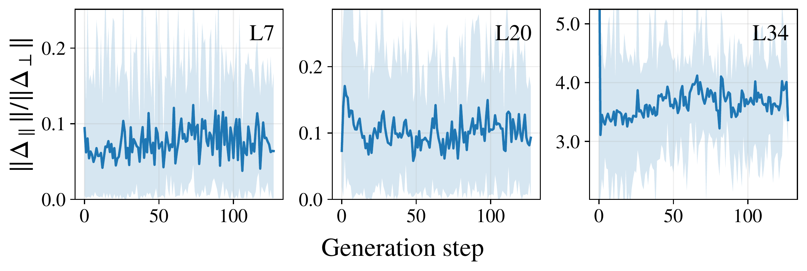
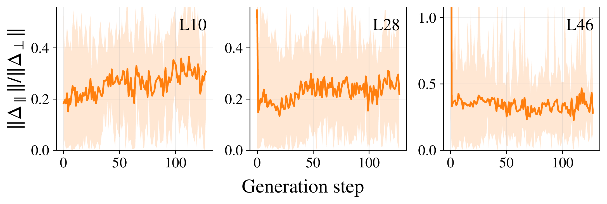
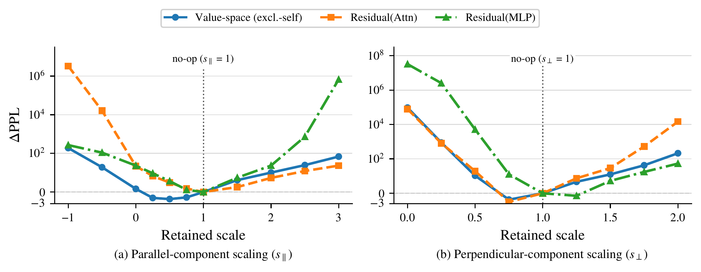
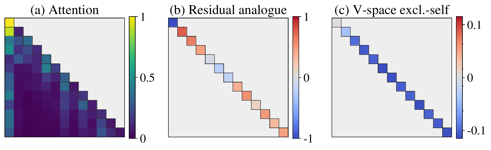
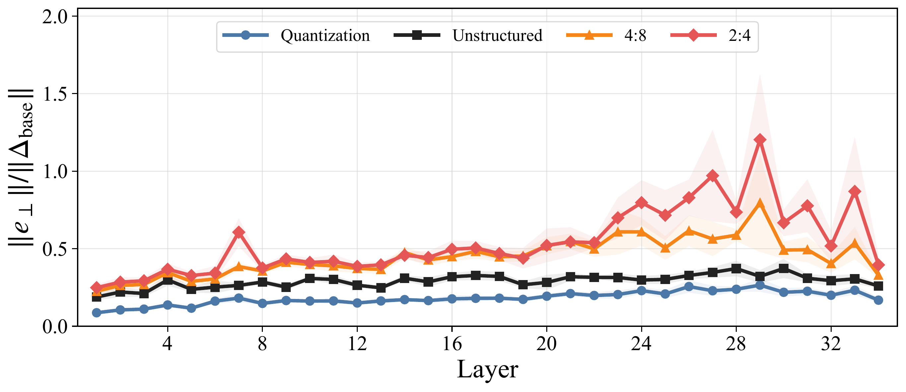
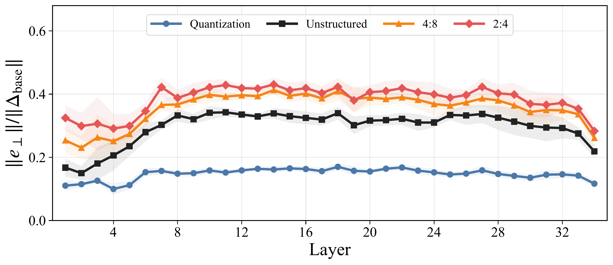
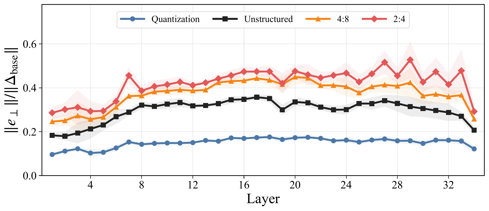
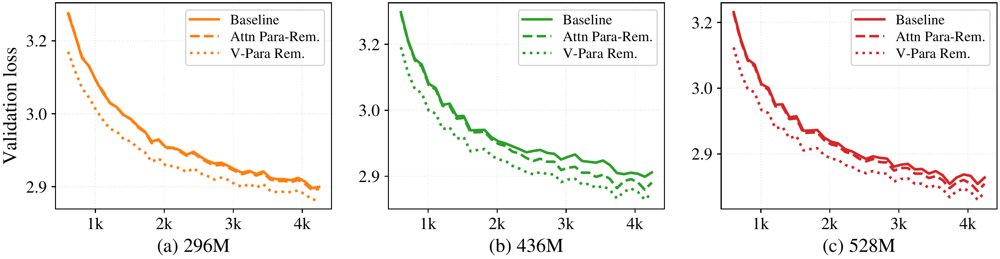

<div align="center">

# 📐 Transformer Geometry
### Decomposing Transformer Updates into Parallel & Perpendicular Subspaces

<p align="center">
  <a href="https://2026.emnlp.org/"></a>
  <a href="https://shwai-he.github.io/Transformer-Geometry/"></a>
  <a href="https://pytorch.org/"></a>
  <a href="https://www.python.org/downloads/"></a>
  <a href="https://huggingface.co/"></a>
</p>

<p align="center">
  <a href="#-overview--core-concept"><b>Overview</b></a> •
  <a href="#-mathematical-foundation"><b>Formulation</b></a> •
  <a href="#-core-research-pillars"><b>Research Pillars</b></a> •
  <a href="#-repository-architecture"><b>Architecture</b></a> •
  <a href="#-installation--setup"><b>Installation</b></a> •
  <a href="#-experiment-execution-guide"><b>Quick Start</b></a>
</p>

---

</div>

## 🌟 Overview & Core Concept

**Transformer Geometry** investigates internal representation dynamics across deep Transformer language models through an orthogonal geometric lens. 

Every hidden-state update $\Delta h$ (produced by multi-head self-attention or feed-forward networks) is decomposed into two complementary geometric components:
1. **Parallel Component** ($\Delta h_{\parallel}$): Projects directly onto the incoming representation vector $h$. It primarily modulates the **magnitude and scaling** of existing semantic features without altering their direction.
2. **Perpendicular Component** ($\Delta h_{\perp}$): Lies strictly orthogonal to $h$. It drives **directional rotation and semantic shifts**, steering the representation into new subspaces.

We extend and evaluate this geometric framework across both **Residual-Space** and **Value-Space (XSA)**, uncovering key mechanisms behind inference-time editing, model compression (pruning & quantization), long-context processing, and pretraining optimization dynamics.

<p align="center">
  
</p>

**Figure 1: Geometric Decomposition and Component Scaling.** Residual updates and attention value aggregates are decomposed into parallel ($\Delta_\parallel$) and perpendicular ($\Delta_\perp$) components and scaled independently; parallel-only scaling can be expressed as an attention-diagonal change. Changing $\Delta_\parallel$ has limited impact on performance, whereas modifying $\Delta_\perp$ sharply degrades perplexity.

---

## 🧮 Mathematical Foundation

For a token representation $h_{l-1} \in \mathbb{R}^d$ entering layer $l$ and generating an update $\Delta h_l$:

$$
\Delta h_l = \Delta h_{l, \parallel} + \Delta h_{l, \perp}
$$

where the parallel component projects directly along the incoming representation:

$$
\Delta h_{l, \parallel} = \frac{\Delta h_l \cdot h_{l-1}}{\|h_{l-1}\|^2} h_{l-1}, \quad \Delta h_{l, \perp} = \Delta h_l - \Delta h_{l, \parallel}
$$

Component-scaling interventions systematically modulate the representation trajectory via scaling factors $\alpha$ and $\beta$:

$$
h_l = h_{l-1} + \alpha \cdot \Delta h_{l, \parallel} + \beta \cdot \Delta h_{l, \perp}
$$

> [!NOTE]
> * **Residual-Space Decomposition**: Operates at the block-output residual stream level: $h_{l} = h_{l-1} + \Delta h_l$.
> * **Value-Space Decomposition (XSA)**: Operates inside the multi-head attention mechanism, projecting aggregated value representations against self-value tokens.

---

## 🔬 Core Research Pillars & Findings

### 1. Geometry Probing (Depth & Subspace Dynamics)
> **Key Finding**: Transformer updates maintain a persistent, non-zero parallel projection across deep layers, counteracting the isotropic dispersion predicted by high-dimensional random geometry.

| (a) Dense Model: Qwen3-4B (Sampled Layers L7, L20, L34) | (b) MoE Model: Qwen3-30B-A3B (Sampled Layers L10, L28, L46) |
| :---: | :---: |
|  |  |

* **Insight**: The projection ratio $r = \|\Delta h_{\parallel}\| / \|\Delta h_{\perp}\|$ remains stably bounded and persistent across both Dense (`Qwen3-4B`) and Mixture-of-Experts (`Qwen3-30B-A3B`) architectures throughout early, intermediate, and deep layers, proving that non-zero parallel projection is a universal property across diverse Transformer families.
* **Theory**: Layer updates decompose into parallel and orthogonal components:
  $$
  \Delta h_l = \Delta h_{l, \parallel} + \Delta h_{l, \perp} \quad \text{where} \quad \Delta h_{l, \parallel} = \frac{\Delta h_l \cdot h_{l-1}}{\|h_{l-1}\|^2} h_{l-1}
  $$
* **Reproduce**:
  ```bash
  python scripts/run_probe.py --model_path Qwen/Qwen2.5-7B
  python scripts/run_batch_probe.py
  ```

---

### 2. Inference Interventions (Component & Diagonal Editing)
> **Key Finding**: Scaling the parallel component $\Delta h_{\parallel}$ exhibits remarkable resilience ($\Delta\mathrm{PPL} \le +0.46$), whereas modifying perpendicular steering $\Delta h_{\perp}$ catastrophically degrades perplexity.

<p align="center">
  
</p>

* **Insight**: Modulating the parallel retained scale $s_{\parallel} \in [-1, 3]$ leaves language modeling ability largely intact (especially under Value-space with self-message preserved), whereas deviating from $s_{\perp} = 1.0$ causes catastrophic error spikes ($10^4$–$10^8$).
* **Attention Diagonal View**: Parallel interventions in attention correspond to closed-form effective diagonal adjustments:
<p align="center">
  
</p>

* **Theory**: Direct self-message preservation isolates cross-token magnitude modulation:
  $$
  \widetilde{\mathbf{o}}^{\mathrm{excl}}_t = \mathbf{d}_t + s^{(\parallel)}\mathbf{c}_{t,\parallel} + s^{(\perp)}\mathbf{c}_{t,\perp}
  $$
* **Reproduce**:
  ```bash
  bash lm-evaluation-harness/scripts/run_lm_eval_xsa_setting.sh
  bash lm-evaluation-harness/scripts/run_lm_eval_attn_diag_setting.sh
  ```

---

### 3. Downstream & Long-Context (RULER Benchmark)
> **Key Finding**: Suppressing cross-token parallel updates preserves core reasoning on standard benchmarks while exposing critical needle-retrieval sensitivities in long-context regimes (4k–12k tokens).

| Intervention Method | Retained Scale $s_\parallel$ | RULER 4k Acc (%) | RULER 8k Acc (%) | RULER 12k Acc (%) |
| :--- | :---: | :---: | :---: | :---: |
| **Dense Baseline** | 1.0 | 86.91 | 82.09 | 79.30 |
| V-Full (All Value Tokens) | 0.5 | 84.81 | 78.80 | 74.76 |
| **V-Excl.-self (Ours)** | 0.5 | **86.69** | **80.80** | **76.88** |
| V-Full (All Value Tokens) | 0.0 | 60.99 | 48.61 | 39.17 |
| **V-Excl.-self (Ours)** | 0.0 | **75.64** | **67.97** | **62.02** |

* **Insight**: Full-aggregate value scaling collapses long-context retrieval (down to 39.17% at 12k), whereas preserving the direct self-message $\mathbf{d}_t$ retains over 75% accuracy at 4k and maintains robust needle recall out to 12k.
* **Reproduce**:
  ```bash
  bash lm-evaluation-harness/scripts/run_lm_eval_ruler_all_settings.sh
  ```

---

### 4. Compression Geometry (Pruning vs. Quantization Distortion)
> **Key Finding**: Pruning methods (Wanda, SparseGPT) heavily distort the perpendicular subspace $\Delta h_{\perp}$, while quantization preserves update geometry substantially closer to dense baselines across Attention, MLP, and combined Block updates.

| Attention Output ($\Delta h_\perp^{\text{attn}}$) | MLP Output ($\Delta h_\perp^{\text{mlp}}$) | Full Block Output ($\Delta h_\perp^{\text{block}} = \text{Attn} + \text{MLP}$) |
| :---: | :---: | :---: |
|  |  |  |

* **Insight**: Relative perpendicular error $\|e_\perp\| / \|\Delta_{\text{base}}\|$ strictly separates structured pruning (2:4, 4:8) and unstructured pruning from quantization. Attention sub-layers suffer the highest orthogonal steering distortion (peaking above 1.2 in upper layers), followed by MLP layers, explaining why isotropic $L_2$ error fails to predict compression degradation.
* **Reproduce**:
  ```bash
  bash scripts/compression_analysis/run_layerwise_para_perp_compare.sh
  ```

---

### 5. Training Optimization (Pretraining with Geometric Inductive Bias)
> **Key Finding**: Suppressing parallel updates during from-scratch pretraining consistently lowers validation-loss trajectories across scales (300M–2.7B) and boosts downstream generalization.

<p align="center">
  
</p>

| Model Scale | Training Configuration | 6-Benchmark Average | $\Delta\text{Avg}$ vs. Baseline |
| :--- | :--- | :---: | :---: |
| **1.4B** | Standard Baseline | 58.5% | — |
| | Attn Para-Removal | 58.8% | +0.3% |
| | **V-Para Removal (Ours)** | **59.2%** | **+0.7%** |
| **2.7B** | Standard Baseline | 60.2% | — |
| | Attn Para-Removal | 60.9% | +0.7% |
| | **V-Para Removal (Ours)** | **61.7%** | **+1.5%** |

* **Insight**: Suppressing parallel updates relieves attention from redundant scalar re-scaling, directing representational capacity toward orthogonal contextual steering and providing +1.5% gains on downstream benchmarks (ARC-Easy, BoolQ, HellaSwag, OpenBookQA, PIQA, WinoGrande).
* **Reproduce**:
  ```bash
  python training/scripts/plot_arr_figure6_retained_curves.py
  bash lm-evaluation-harness/scripts/run_lm_eval_nanogpt_setting.sh
  ```

---

## 📂 Repository Architecture

```text
Transformer-Geometry/
├── src/repgeo/                 # Reusable core geometry, projection, and intervention utilities
│   ├── geometry_utils.py       # Parallel / perpendicular projection math & metrics
│   └── hooks.py                # PyTorch forward hook mechanisms for dynamic interventions
│
├── lm-evaluation-harness/      # Forked evaluation harness supporting geometric hook configurations
│   ├── lm_eval/models/         # Attention diagonal and residual modification hooks
│   └── scripts/                # Launchers for downstream benchmarks & RULER long-context evals
│
├── analysis/                   # Diagnostic, visualization, and ablation workspaces
│   ├── forward_geometry/       # Alpha/gamma parameter sweeps and forward generation ablations
│   ├── gsm_math/               # Mathematical reasoning & GSM8K dual-path sanity checks
│   ├── model_compare/          # Dense vs. dropped/pruned/masked-teacher subspace comparisons
│   ├── nanogpt/                # Lightweight nanoGPT checkpoint diagnostics and layer visualizations
│   └── vlm_geometry/           # Vision-language model parallel/perpendicular scaling hooks
│
├── compression/                # Pruning and quantization geometric error analysis
│   ├── code/                   # Geometry-aware pruning & layerwise comparison implementations
│   └── scripts/                # Shell runners for intra/inter-layer compression sweeps
│
├── training/                   # Scratch pretraining and optimization dynamics experiments
│   └── scripts/                # Launchers for parallel-suppressed training runs
│
├── scripts/                    # Root-level probing runners and reproducibility utilities
└── requirements.txt            # Base Python dependencies
```

---

## 🛠️ Installation & Setup

### 1. Environment Creation

```bash
# Create dedicated conda environment
conda create -n transformer-geometry python=3.10 -y
conda activate transformer-geometry

# Install root dependencies
pip install -r requirements.txt

# Install the geometric-aware lm-evaluation-harness
cd lm-evaluation-harness
pip install -e .
cd ..
```

### 2. Backends & Acceleration

Ensure you have a CUDA-compatible PyTorch build alongside standard HuggingFace acceleration packages:
```bash
pip install torch torchvision --index-url https://download.pytorch.org/whl/cu121
pip install transformers accelerate datasets evaluate
```

---

## 🚀 Experiment Execution Guide

> [!TIP]
> **File-First Configuration Convention**: Most experiment launchers are configured directly near the top of the shell/Python script. Open the target script to adjust `MODEL_PATH`, `GPU_DEVICES`, and `OUTPUT_DIR` before running.

### 1. Geometry Probing Across Depths
Extract parallel/perpendicular ratios, angular velocities, and magnitude projections:
```bash
# Single model probe
python scripts/run_probe.py --model_path Qwen/Qwen2.5-7B --dataset wikitext

# Batch probing across model families
python scripts/run_batch_probe.py --config configs/probe_models.yaml
```

### 2. Inference-Time Component & Diagonal Interventions
Evaluate the effect of scaling $\Delta h_{\parallel}$ vs $\Delta h_{\perp}$ on language modeling:
```bash
# Run XSA (cross-subspace attention) intervention sweep
bash lm-evaluation-harness/scripts/run_lm_eval_xsa_setting.sh

# Run attention diagonal scaling ablation
bash lm-evaluation-harness/scripts/run_lm_eval_attn_diag_setting.sh
```

### 3. Long-Context RULER Evaluation Suite
Benchmark context-window integrity under geometric modifications:
```bash
bash lm-evaluation-harness/scripts/run_lm_eval_ruler_all_settings.sh
```

### 4. Compression Error & Geometry-Aware Pruning
Analyze distortion caused by pruning (Wanda, SparseGPT) and quantization:
```bash
# Layerwise parallel/perpendicular distortion comparison
bash compression/scripts/run_layerwise_para_perp_compare.sh

# Run geometry-guided pruning
bash compression/scripts/run_geometry_aware_pruning.sh
```

### 5. Training-Time Interventions (nanoGPT & Scratch Sweeps)
Train small-to-medium models with suppressed parallel components and evaluate checkpoints:
```bash
# Pretraining experiments
cd training && bash scripts/run_nanogpt_geom_train.sh && cd ..

# Evaluate trained checkpoints on standard tasks
bash lm-evaluation-harness/scripts/run_lm_eval_nanogpt_setting.sh
python lm-evaluation-harness/scripts/collect_nanogpt_lm_eval_results.py
```

---

## 📖 Module Documentation Index

For detailed workspace-specific guidance, refer to sub-package documentation:
* [lm-evaluation-harness/scripts/README.md](lm-evaluation-harness/scripts/README.md) — Evaluation harness launcher parameters & task definitions.
* [analysis/README.md](analysis/README.md) — Standalone analysis utilities, forward geometry, and visualization tools.
* [compression/README.md](compression/README.md) — Pruning/quantization theory and geometry-aware pruning docs.
* [training/README.md](training/README.md) — Scratch training setups, configs, and checkpoint logging.

---

## 📜 Citation

```bibtex
@inproceedings{he2026transformer_geometry,
  title={Disentangling Representation Evolution in Transformers through Directional Decomposition},
  author={He, Shwai and Zhang, Haichao and Yan, Shen},
  booktitle={Proceedings of the 2026 Conference on Empirical Methods in Natural Language Processing (EMNLP)},
  year={2026}
}
```

<div align="center">
  <sub>Built for principled geometric analysis of deep transformer architectures.</sub>
</div>
